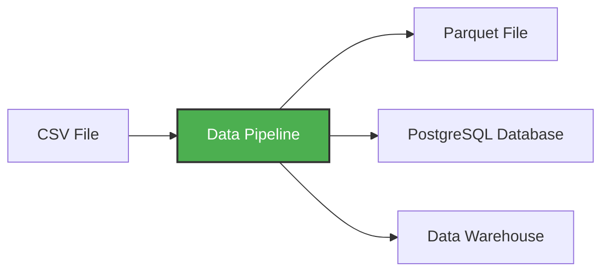

# Virtual Environment Set-Up
Instead of Pip, we choose to work with `uv`. It is the modern light weight and powerful dependency manager, it fast and very reliable cos its written in **Rust**.

### The Standard Workflow

1. Initialize: `uv init`
    - Creates your project structure and pyproject.toml.

2. Add Tools: `uv add pandas sqlalchemy psycopg2-binary`
    - This updates the "Shopping List" and "Receipt" automatically.

3. Sync (The "Fixer"): `uv sync`
    - Ensures your .venv perfectly matches your uv.lock. If you delete your .venv, this command brings it back to life.

4. Execute: `uv run python script.py`
    - The "Silver Bullet." It handles the environment context so you don't have to manually "activate" anything.

### Component and Role
- `pyproject.toml`: The Manifest >> Our Shopping List: It says "I need Pandas and SQLAlchemy."
- `uv.lock`: The State >> Our Receipt. It records the exact version and "fingerprint" of every library.
- `.venv/`:	The Workspace >> The Kitchen. Where the actual work happens. It's replaceable!


### Benefits of `uv`:
1. Isolation is Guaranteed: Project A's libraries never touch Project B's.

2. Version Pinning: The uv.lock file means you never accidentally upgrade a library that breaks your database connection.

3. Portability: When you eventually move your code into a Docker Image, you simply tell Docker: "Look at my uv.lock and build this exact same environment."


# Docker Fundamentals

Docker is a _containerization software_ that allows us to isolate software in a similar way to virtual machines but in a much leaner way.

- Docker is like a portable house for storing and keeping essitials only associated within it.
To run docker, we use the command `docker run <DOCKER FILE NAME>`. To be able to interact with the docker file we run in `-it`as in `docker run -it <DOCKER FILE NAME>`, e.g. 
```bash 
docker run -it ubuntu
```

A Docker image is a _snapshot_ of a container that we can define to run our software, or in this case our data pipelines. By exporting our Docker images to Cloud providers such as Amazon Web Services or Google Cloud Platform we can run our containers there.

## Why Docker?

Docker provides the following advantages:

- Reproducibility: Same environment everywhere
- Isolation: Applications run independently
- Portability: Run anywhere Docker is installed

They are used in many situations:

- Integration tests: CI/CD pipelines
- Running pipelines on the cloud: AWS Batch, Kubernetes jobs
- Spark: Analytics engine for large-scale data processing
- Serverless: AWS Lambda, Google Functions

## Basic Docker Commands

Check Docker version:

```bash
docker --version
```


- Docker is stateless, which means after running a file any new activity created within it is not actively saved when you return into the container. Run `docker ps -aq` to see the list of created docker volumes (id) and `docker ps -a` to see the list of docker images. To remove all existing volumes (images), run `docker rm 'docker ps -aq'`

## Docker Compose

In the early days, we had to manually configure IP addresses and network bridges just to get a database to talk to a UI. Today, we use **Docker Compose**

Imagine a docker-compose.yaml file as a blueprint for a mini-datacenter that lives on your laptop. Instead of one giant computer, we’re building a cluster of specialized "rooms" (containers) that are wired together perfectly.

- ### Anatomy of a docker image file (.yaml)
```bash 
services:
  pgdatabase:
    image: postgres:18
    environment:
      POSTGRES_USER: "root"
      POSTGRES_PASSWORD: "root"
      POSTGRES_DB: "ny_taxi"
    volumes:
      - ny_taxi_postgres_data:/var/lib/postgresql
    ports:
      - "5432:5432"

  pgadmin:
    image: dpage/pgadmin4
    environment:
      PGADMIN_DEFAULT_EMAIL: "admin@admin.com"
      PGADMIN_DEFAULT_PASSWORD: "root"
    volumes:
      - pgadmin_data:/var/lib/pgadmin
    ports:
      - "8085:80"

volumes:
  ny_taxi_postgres_data:
  pgadmin_data:
```
### 1. Services: The "Rooms"

This section defines the containers we want to run. In this module, we usually have two:

- `pgdatabase`: This is your "Engine Room." It’s running Postgres 18.

- `pgadmin`: This is your "Control Tower." It’s a web-based GUI to manage the engine room

### 2. Ports: The "Gateways"

This is where traffic flows from your laptop into the containers.

    Postgres (5432:5432): Standard. You talk to Postgres on your machine using the default port.

    pgAdmin (8085:80): Notice the change here. Internally, pgAdmin listens on port 80 (HTTP). You’ve mapped it so that you access it in your browser via localhost:8085.

### 3. Environment: The "Keys"

This is where we set our passwords and usernames:

    POSTGRES_USER=root

    POSTGRES_PASSWORD=root

    POSTGRES_DB=ny_taxi 
**Tip:** In a real production environment, we’d use secrets, but for learning, hard-coding these is fine—just don't do it with your bank password!

### 4. Ports: The "Windows"

`ports: - "5432:5432"`

The left side is your laptop (the Host).

The right side is the inside of the container. This maps your laptop’s port 5432 to the database’s port 5432. It’s like a wormhole between your computer and the container.

### 5. Volumes: The "Pantry"
```bash
volumes:
      - ny_taxi_postgres_data:/var/lib/postgresql
```

This is the most "Senior" part of your YAML.

Containers are ephemeral—meaning if you stop them, they "forget" everything. Volumes are folders on your Linux system that stay put. By "mounting" this volume, your data survives even if you delete the container.

## Connecting a volume to a local directory
Lets say we have a `python` container. If we want bash, we need to overwrite `entrypoint` with `bash`:

```bash
docker run -it \
    --rm \
    --entrypoint=bash \
    python:3.9.16-slim
```
Now we can map a local repository to the `python` container 
```bash
docker run -it \
    --rm \
    -v $(pwd)/test:/app/test \
    --entrypoint=bash \
    python:3.9.16-slim
```
Inside the python container, we can run python scrips that acces docs from the local repository.


# Docker images: A Data Pipeline example
Now, let's "containerize" a pipeline. We need a Dockerfile that takes the python code and the uv environment, then bakes them into an image.

A **data pipeline** is a service that receives data as input and outputs more data. For example, reading a CSV file, transforming the data somehow and storing it as a table in a PostgreSQL database.

In short, A data pipeline is a process that takes data from one point to another


To create a data pipeline for the `pipeline.py` script, we Create a simple `Dockerfile` file for it as follows:
```bash
FROM ghcr.io/astral-sh/uv:python3.12-alpine

WORKDIR /app
ENV PATH="/app/.venv/bin:$PATH"

# Now we copy from the perspective of the project root
COPY pyproject.toml .python-version uv.lock ./

RUN uv sync --locked

# Copy the pipeline script specifically from the module folder
COPY M01-docker-terraform/pipeline.py .

ENTRYPOINT ["python", "pipeline.py" ]
```


Let's break down your specific recipe line-by-line.
1. The Foundation (FROM)

```bash
FROM ghcr.io/astral-sh/uv:python3.12-alpine
```
Concept: Every image starts with a parent.
python3.12: The Python version.
alpine: A tiny, 5MB version of Linux. Industry pros love it because it’s secure and lightweight.
uv: This base already has the uv tool pre-installed.

2. The Context (WORKDIR)

`WORKDIR /app`

Concept: This is the internal cd command.Everything we do from here on happens inside a folder named /app inside the image. It keeps our "frozen computer" tidy.

3. The Wiring (ENV PATH)
```bash
ENV PATH="/app/.venv/bin:$PATH"
```
Concept: Setting the "Look Here First" rule.When uv installs packages, it puts them in a virtual environment (.venv). This line tells the computer: "When I type python, look inside the .venv folder before looking anywhere else."

4. The Manifests (COPY)
```bash
COPY pyproject.toml .python-version uv.lock ./
```
Concept: Moving the "Shopping List" from your laptop into the image. We copy these files first and separately. Why? Layer Caching. Docker remembers that it has already seen these files. If you change your code but not your libraries, Docker will skip the expensive "install" step next time you build.

5. The Build Step (RUN)

`RUN uv sync --locked`

Concept: Actually doing the work. This command runs during the build phase. It downloads all the libraries in your uv.lock and creates the environment. Once this is done, those libraries are "baked" into the image forever.

6. The Logic (COPY)
```bash
COPY M01-docker-terraform/pipeline.py .
```
Concept: Moving the actual "Brain" of the operation. We copy your script last. Since your code changes more often than your libraries, putting this last ensures your builds stay lightning-fast.

7. The Default Command (ENTRYPOINT)
`ENTRYPOINT ["python", "pipeline.py" ]`

Concept: The "Play" button. This tells the container what to do the moment it wakes up. When you run the container, it immediately executes python pipeline.py.


